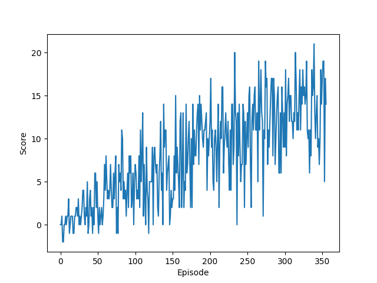
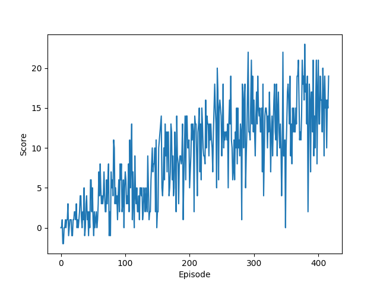
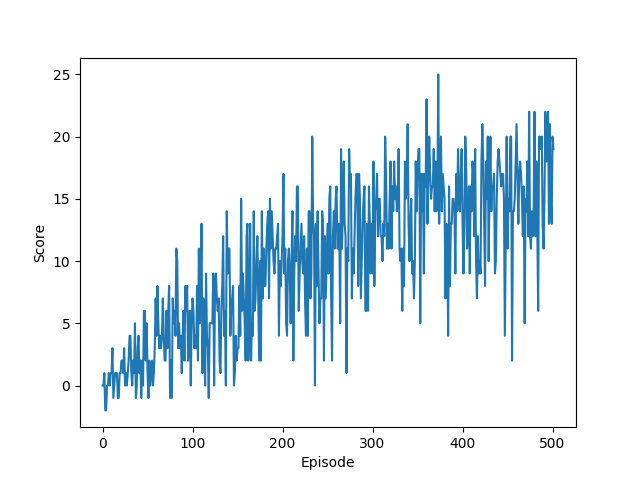
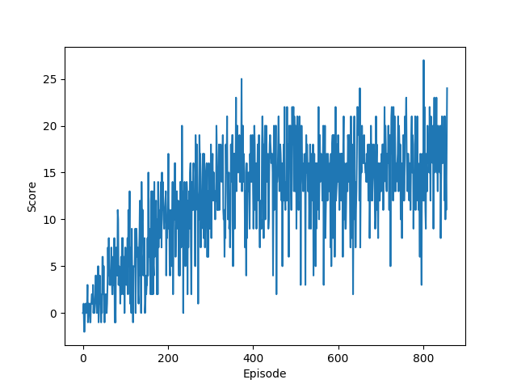

# Report

This report presents the approach taken to solve the first project of Udacity's Deep Reinforcement Learning Nanodegree Program, where the goal is to to train an agent to navigate and collect bananas in a large, square world. The agent receives a reward of +1 for collecting a yellow banana and a reward of -1 for collecting a blue banana. Hence, the goal of the agent is to collect as many yellow bananas as possible while avoiding blue bananas. Furthermore, this report also shows some results and directions for future work.

## Solution

The agent performs Deep Q-Learning in the environment. Addressing the problem as an episodic task, the agent trains for `n_episodes` or until it solves the environment. The environment is solved when the agent receives an average reward of +13 over the last 100 episodes.

### Q-Learning hyperparameters

The Q-Learning algorithm has the following hyperparameters:
- **`n_episodes`** (2000): number of episodes to run;
- **`max_t`** (1000): maximum timesteps per episode;
- **`eps_start`** (0.50): start value for epsilon-greedy search;
- **`eps_end`** (0.01): end value for epsilon-greedy search;
- **`eps_decay`** (0.99): decay factor for epsilon-greedy search.


### Agent hyperparameters

The agent uses the following hyperparameters:
- **`BUFFER_SIZE`** (1e5): size of the replay buffer;
- **`BATCH_SIZE`** (64): size of the mini-batches;
- **`GAMMA`** (0.99): discount factor;
- **`TAU`** (1e-3): interpolation factor for the soft update of the target network;
- **`LR`** (5e-4): learning rate of the Adam optimizer;
- **`UPDATE_EVERY`** (4): frequency of updating the network.


### Neural network architecture

The neural network consists of two fully-connected layers of 64 units each.

## Results

We trained four different agents for increasingly more complex versions of the environment. We varied the condition for solving the environment from obtaining an average reward of +13 over the last 100 episodes in steps of one to an average reward of +16. The weights of the neural networks for the trained agents are in the `weights-N.pth` files, where `N` corresponds to the average reward obtained by the agent.

### Average reward of 13



```
Episode 100	Average score: 2.57
Episode 200	Average score: 6.77
Episode 300	Average score: 11.89
Episode 371	Average score: 13.06

Environment solved in 271 episodes!	Average score: 13.06
```

### Average reward of 14



```
Episode 100	Average score: 2.57
Episode 200	Average score: 6.84
Episode 300	Average score: 11.22
Episode 395	Average score: 14.03

Environment solved in 295 episodes!	Average score: 14.03
```

### Average reward of 15



```
Episode 100	Average score: 2.57
Episode 200	Average score: 7.10
Episode 300	Average score: 10.90
Episode 400	Average score: 14.29
Episode 500	Average score: 14.91
Episode 502	Average score: 15.08

Environment solved in 402 episodes!	Average score: 15.08
```

### Average reward of 16



```
Episode 100	Average score: 2.57
Episode 200	Average score: 7.10
Episode 300	Average score: 10.90
Episode 400	Average score: 14.29
Episode 500	Average score: 14.91
Episode 600	Average score: 14.48
Episode 700	Average score: 14.77
Episode 800	Average score: 15.61
Episode 857	Average score: 16.01

Environment solved in 757 episodes!	Average score: 16.01
```

## Future work

The following future work directions are worth exploring:
* **Optimize hyperparameters and network architecture:** optimize the parameters using Bayesian optimization;
* **Perform Double Q-Learning:** replace the Q-Learning algorithm by the Double Q-Learning algorithm ([paper](http://www.aaai.org/ocs/index.php/AAAI/AAAI16/paper/download/12389/11847));
* **Use Dueling Q-Networks:** replace the Q-Network with a Dueling Q-Network ([paper](https://arxiv.org/pdf/1511.06581.pdf)).